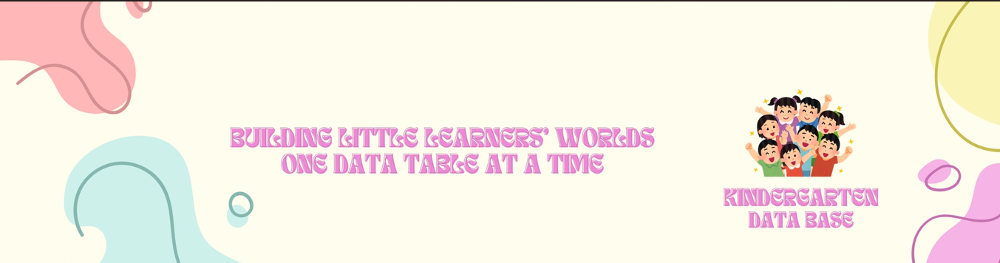
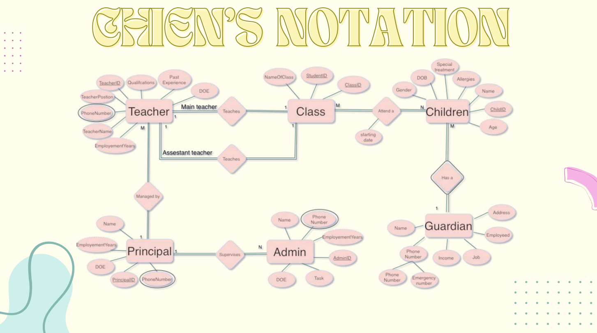
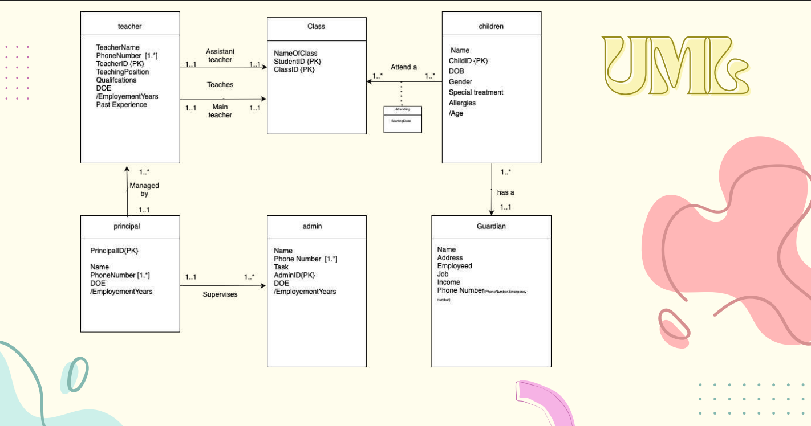
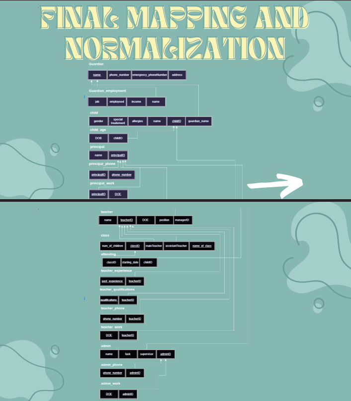
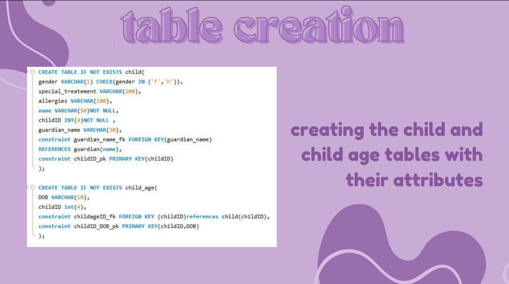
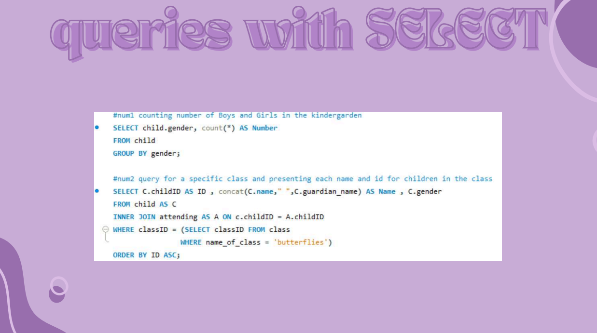
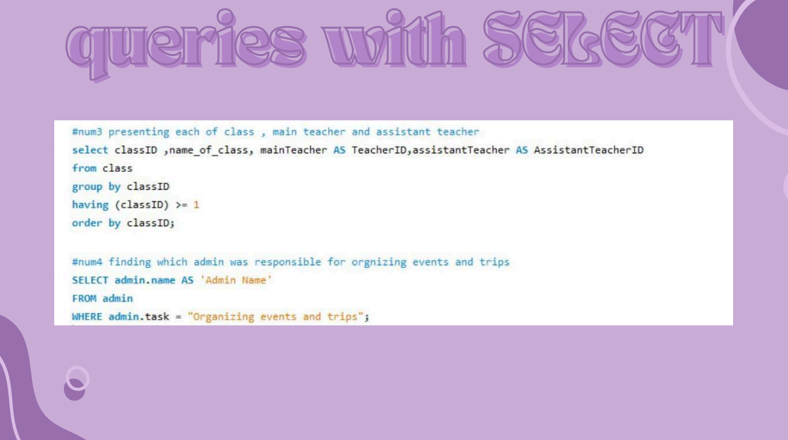
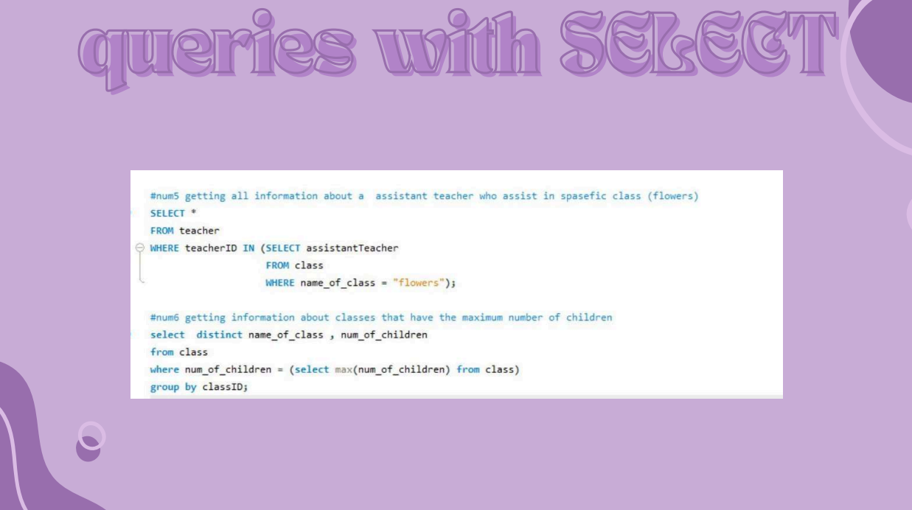

# 🏫 Kindergarten Database Management System

<p align="center">
  
</p>

<p align="center">
  
  
  
  
</p>

---

## 📌 Project Overview

The Kindergarten Database Management System is a comprehensive relational database project developed to streamline and organize kindergarten operations.

The system manages children, guardians, teachers, administrators, classes, attendance records, and staff relationships while ensuring data integrity and reducing redundancy through proper database normalization.

This project demonstrates the complete database development lifecycle from conceptual design to SQL implementation.

---

## 🎯 Objectives

* Design a scalable relational database.
* Apply database modeling techniques.
* Implement ERD and UML diagrams.
* Perform relational mapping.
* Normalize data up to Third Normal Form (3NF).
* Create and populate database tables using SQL.
* Develop meaningful analytical queries.

---

# 🏗️ Database Design

## Entity Relationship Diagram (ERD)

<p align="center">
  
</p>

The ERD illustrates the relationships between children, guardians, teachers, administrators, classes, attendance records, and the principal.

---

## UML Diagram

<p align="center">
  
</p>

The UML model provides a structured representation of the system entities and their associations.

---

# 🔄 Relational Mapping & Normalization

## Relational Mapping

<p align="center">
  
</p>

The conceptual design was transformed into a relational schema suitable for SQL implementation.

---

## Database Normalization

The database was normalized up to **Third Normal Form (3NF)** to eliminate redundancy and improve consistency.

### First Normal Form (1NF)

✔ Removed repeating groups and multivalued attributes.

### Second Normal Form (2NF)

✔ Eliminated partial dependencies.

### Third Normal Form (3NF)

✔ Eliminated transitive dependencies.

<p align="center">
  
</p>

---

# 🛠️ Technologies Used

| Technology         | Purpose               |
| ------------------ | --------------------- |
| MySQL              | Database Management   |
| SQL                | Database Development  |
| ER Modeling        | Conceptual Design     |
| UML                | System Modeling       |
| Relational Mapping | Logical Design        |
| Normalization      | Database Optimization |

---

# 📂 Database Modules

### 👶 Child Management

* Child Information
* Age Records
* Medical Conditions
* Allergies
* Special Treatments

### 👨‍👩‍👧 Guardian Management

* Contact Information
* Employment Details
* Income Information
* Emergency Contacts

### 👩‍🏫 Staff Management

* Principal
* Teachers
* Assistant Teachers
* Administrators

### 🏫 Class Management

* Class Assignment
* Attendance Tracking
* Teacher Allocation

---

# 💻 SQL Implementation

## Database Schema

<p align="center">
  
</p>

---

## Data Insertion

<p align="center">
  
</p>

---

# 🔍 Sample Queries

## Count Boys and Girls

<p align="center">
  
</p>

---

## Display Children in a Specific Class

<p align="center">
  
</p>

---

## Display Class Teacher Information

<p align="center">
  
</p>

---

# 📁 Project Structure

```text
kindergarten-database-system
│
├── README.md
│
├── sql
│   └── kindergarten_database.sql
│
├── documentation
│   └── kindergarten_database_documentation.pdf
│
├── diagrams
│   ├── er_diagram.png
│   └── uml_diagram.png
│
├── screenshots
│   ├── relational_mapping.png
│   ├── normalization.png
│   ├── schema_creation.png
│   ├── data_insertion.png
│   ├── query1.png
│   ├── query2.png
│   └── query3.png
│
└── assets
    └── cover.png
```

---

# 📖 Documentation

Complete project documentation is available in:

```text
documentation/kindergarten_database_documentation.pdf
```

---

# 🌟 Skills Demonstrated

* Database Design
* SQL Development
* Database Normalization
* ER Modeling
* UML Modeling
* Relational Mapping
* Data Integrity
* Query Development
* Schema Design

---

# 👥 Team Members

* Maysam Abdul Jalil
* Nada Al-Harbi
* Wsaif Al-Khuzaie
* Shumukh Al-Bargi
* Yasmeen Al-Mutaani
* Renad Hatem Ahmad

---

# 👩‍💻 Author

**Maysam Abduljalil**

GitHub: https://github.com/maysamma